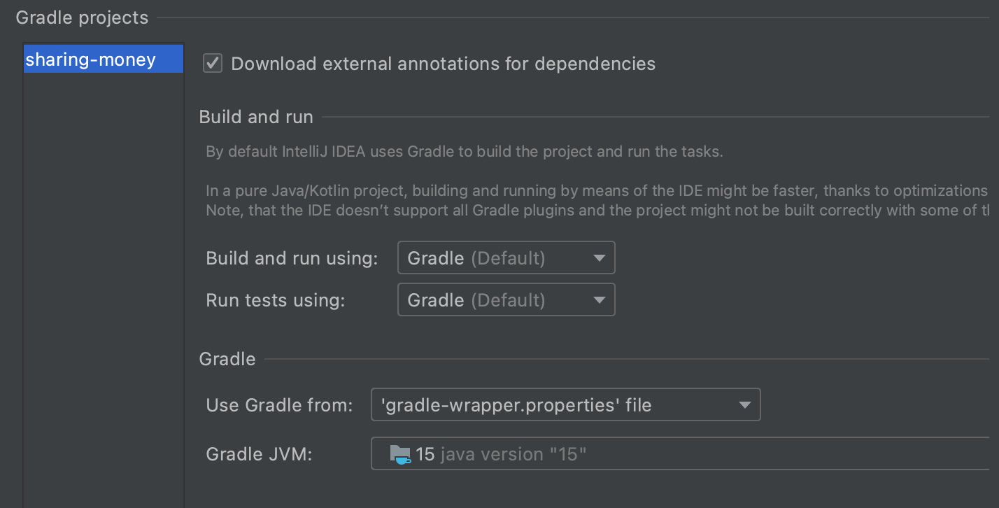
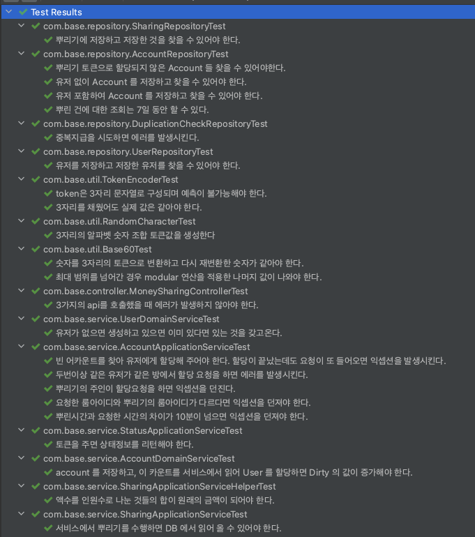

# sharing-money
## java version
#### ZGC 와 records, text block, seal class 와 같은 최신 문법을 사용하기 위해, amazon 의 java 15 버전을 사용합니다. "15.0.0-amzn"
## java 15 설치방법
### 다운로드
```
$ curl -s "https://get.sdkman.io" | bash
```
### sdk man 실행
```
$ source "$HOME/.sdkman/bin/sdkman-init.sh"
```
### annotation process 를 지원하는 java 15 amazon 버전으로 인스톨
```
$ sdk i java 15.0.0-amzn
```
### 지금 디렉토리에서 java 15 버전으로 변경
```
$ sdk u java 15.0.0-amzn
```
### 어플리케이션 빌드하는 방법
```
./gradlew clean build
```
### 어플리케이션 실행하는 방법
- 프로젝트의 루트에서 아래와 같이 실행하면 됩니다. GC 는 ZGC 를 사용합니다.
```
java -jar -XX:+UseZGC -Xms512m -Xmx1g --enable-preview ./api/build/libs/api-0.0.1-SNAPSHOT.jar
```
### 인테리제이의 gradle 플러긴 컴파일 에러가 나오는 경우
- 아래와 같 인텔리제이의 G이radle plugin 의 JVM 의 version을 15 로 맞춰줘야 합니다.


### 문제 해결 전략
- 무작위랜덤 3자리는 서로다른 서버에서 중복가능성이 높으므로  
DB 에서 한번 저장하고 다시 AutoIncrease 된값을 얻어서 60글자(60진법) 숫자+문자의 조합으로 해시값을 만들어 토큰을 생성했습니다.

- 설계 : Sharing 테이블이 뿌리기의 핵심에 해당하는 테이블이며, Account 가 분배된 금액을 갖고 있는 테이블입니다.  
Sharing 과 Account 의 관계는 1:N 입니다.
N+1 문제가 생기지 않게 @OneToMany Lazy 로딩을 사용하지 않고, @ManyToOne 만의 관계를 설정하여서 
조인한 데이터가 필요할때만 Repository 의 (JPQL 조인 패치를 사용한) 함수를 명시적으로 불러서 갖고 오게 했습니다.
(조인 패치를 위한 JPQL 구문에 java 15의 textblock 을 적용했습니다.)
DDD 고려하여 도메인 객체를 직접 제어하는 경우는 DomainService로 어플리케이션의 비즈니스 로직을 위해서는 ApplicationService 로 
나누었습니다.

- api 내역(http://localhost:8080/swagger-ui.html)
- 1 뿌리기 api 는 MoneySharingController( money-sharing-controller
 ) 에 구현
- 2 받기 api 는 MoneyAccountController( money-account-controller
 ) 에 구현
- 3 조회 api 는 MoneyStatusController( money-status-controller
 ) 에 구현
되어 있습니다.

- RaceCondition 처리 : 동시에 여러 사용자가 한꺼번에 할당요청을 할경우를 위해 Account 엔티티에 @Version 값을 할당하 
여 PESSIMISTIC_FORCE_INCREMENT 으로 락을 걸었습니다. 개발중 OPTIMISTIC 으로는 실패케이스가 있어서 강한 락을 걸었습니다.
 
- 테스트 : spock 프레임워크를 사용하여 테스트하였습니다. 서비스의 public 함수는 대부분 테스트를 먼저 개발하고 나서 실제 코드를 구현하였습니다.
DTO 나 Config 와 같은 클래스를 빼고는 대부분 테스트되었으나, Java15 를 사용한 것때문인지 IntelliJ 의 
CodeCoverage 기능 자체가 에러가 나와서 Coverage 비율을 확인할 수는 없었습니다. 일반적인 gradle 이나 인텔리 제이의 테스트 기능으로는 모두 성공하고 있습니다. 
 
 
- 유효성 검는 입력 DTO 에서 할 수 있는 것은 @Valid 로 검증을 하였지만, 대부분의 Validation 은 서비스 층에서 
검증을 하여 Exception 을 발생하게 하였습니다.
만약 Exception 이 발생하면 글로벌 익셉션 핸들러(SharingMoneyRestGlobalExceptionHandler) 에서 받아서 다시 에러메시지와 에러 코드로 변환하여
리턴하게 하였습니다. 

- 엔티티의 생성 수정날짜는 JpaAuditing 을 사용하여 CommonEntity 를 상속하면 자동 생성하게 되었으며, 
이 부분에 java 15의 sealed 클래스를 적용하였습니다. DTO는 모두 Java 15의 record(Kotlin 의 data 와 유사)로 구현하였습니다.
